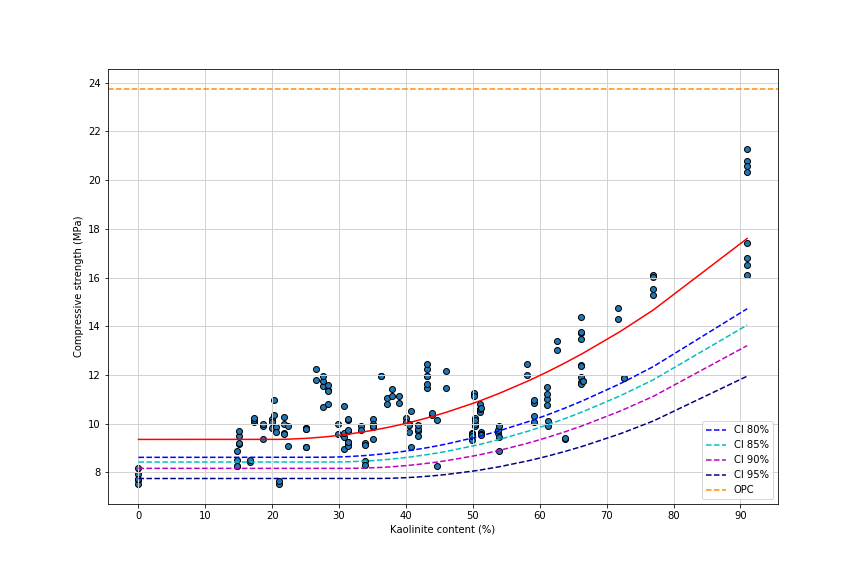
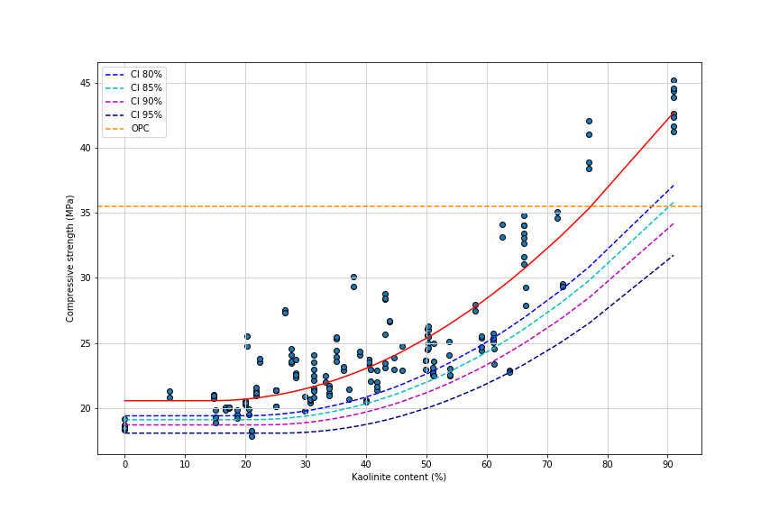
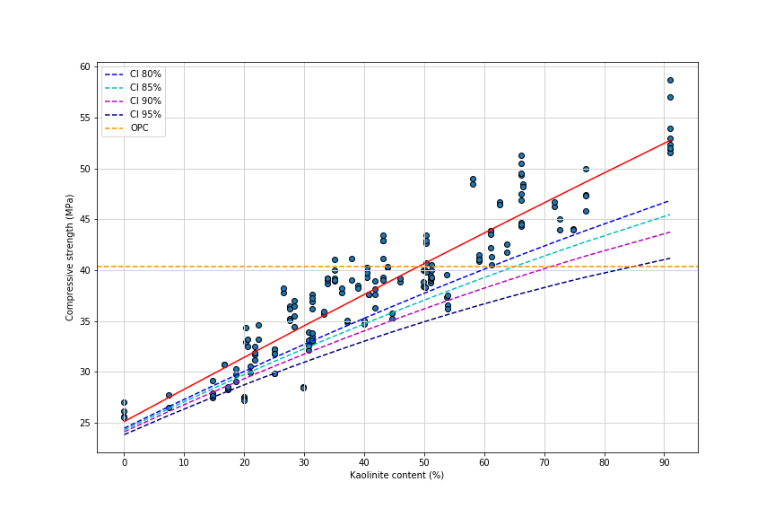
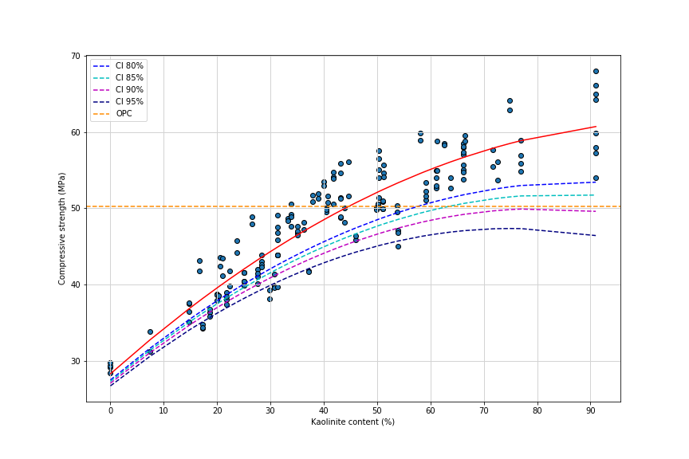
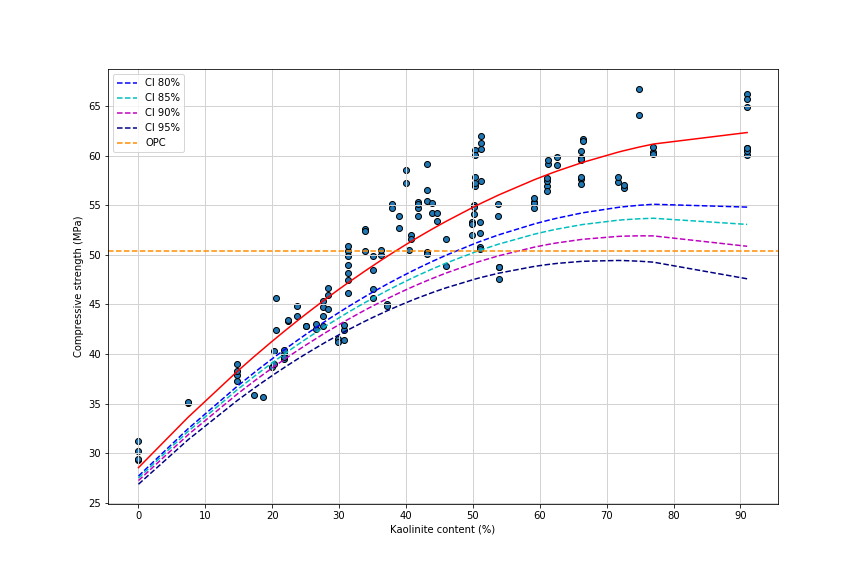

# LC3 compressive strength analysis

<table><tr>
<td>  </td>
<td>  </td>
</tr></table>

Project carried out whithin [LC3 project](https://lc3.ch/) in collaboration with the [EPFL](https://www.epfl.ch/en/) _Construction Materials Laboratory_ and under the supervision of Doctor Franco Alberto Zunino.

## Authors
* Francisco Javier Blázquez Martínez
* Andrés Montero Ranc
* David Alonso del Barrio

## Abastract
LC3 stands for Limestone Calcined Clay Cement, it is the newest type of cement that offers an alternative for environmental sustainability, it is made with calcined clay, this material can be found in abundance, it is an ecological cement that contains less clinker and uses less fuel in its production, therefore reducing CO2 emissions by up to 30\%.

## Results

The final report summarizing the results obtained and the proccedure followed can be seen [here](./LC3/LC3.pdf). We include below the two-dimensional models that relate the kaolinite content of the clay used with the compressive strength as well as their confidence intervals.

**Day 1** \

**Day 3** \

**Day 7** \

**Day 28** \

**Day 90** \

## Repository structure
In the repository you will find two files in _data_ folder, one with all the compressive strength measurements made using different clays and the characteristics of these clays (_data\_full_) and the other with the averages and standard deviation of the compressive strength, together with the characteristics of the clays(_data\_merged_). You will also find three notebooks that show all the work done, and a .py file that contains the functions used in those notebooks. 

